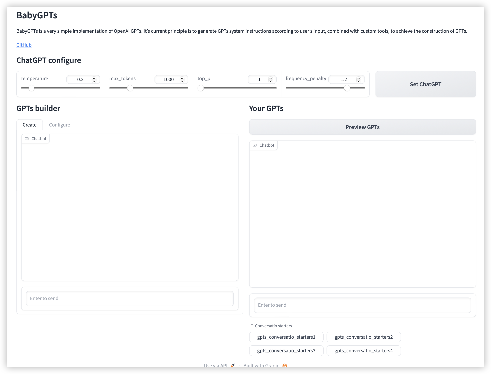

# BabyGPTs: A simple implementation of GPTS

## Intruction

BabyGPTs is a very simple implementation of OpenAI GPTs. It's current principle is to generate GPTs system instructions according to user's input, combined with custom tools, to achieve the construction of GPTs. 



The main features of BabyGPTs are:

- 
- 

The schematic diagram of BabyGPTs is shown as follows.


## News


## Get started

**Step1: prepare the run environment**


**Step2: run webui and set ChatGPT parameters**


**Step3: input your requirements**


**Step4: configure your tools**


**Step5: build your GPTs**


Some free HF tools you can refer to:

- Text-to-image

  - model_url: https://huggingface.co/stabilityai/stable-diffusion-xl-base-1.0

    ```json
    {
      "model_description": "This is a model that can be used to generate and modify images based on text prompts.",
      "params_name": "inputs",
      "type": "string",
      "description": "The text to generate images.",
      "required": "true"
    }
    ```

  - model_url: https://huggingface.co/runwayml/stable-diffusion-v1-5

    ```json
    {
      "model_description": "This is a latent text-to-image diffusion model capable of generating photo-realistic images given any text input.",
      "params_name": "inputs",
      "type": "string",
      "description": "The text to generate photo-realistic images.",
      "required": "true"
    }
    ```

  - model_url: https://api-inference.huggingface.co/models/stabilityai/stable-diffusion-2-1

    ```json
    {
      "model_description": "This is a latent text-to-image diffusion model capable of generating photo-realistic images given any text input.",
      "params_name": "inputs",
      "type": "string",
      "description": "The text to generate photo-realistic images.",
      "required": "true"
    }
    ```

- Text-to-speech

  - model_url: https://huggingface.co/facebook/mms-tts-eng

    ```json
    {
      "model_description": "This is a English (eng) language text-to-speech (TTS) model. This is an end-to-end speech synthesis model that predicts a speech waveform conditional on an input text sequence.",
      "params_name": "inputs",
      "type": "string",
      "description": "The text to generate speech.",
      "required": "true"
    }
    ```

  - Model_url: https://api-inference.huggingface.co/models/facebook/musicgen-small

    ```json
    {
      "model_description": "This is a text-to-music model capable of genreating high-quality music samples conditioned on text descriptions or audio prompts.",
      "params_name": "inputs",
      "type": "string",
      "description": "text descriptions or audio prompts to generate music.",
      "required": "true"
    }
    ```

## Some example demos


## TODO

- [ ] Add document upload and knowledge retrieval
- [ ] Add python code execution environment
- [ ] Support for more types of tools
- [ ] More complex agents, including planning capabilities
- [ ] Support image upload and doc upload


## Citation

If you found this work useful, consider giving this repository a star and citing our paper as follows:

```
@misc{wupingyu2023,
  author={Xudong Li},
  title = {BabyGPTS},
  year = {2023},
  publisher = {GitHub},
  howpublished = {\url{https://github.com/5663015/GPTs.git}},
}
```

