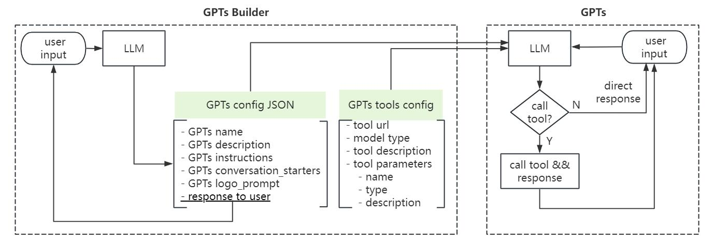
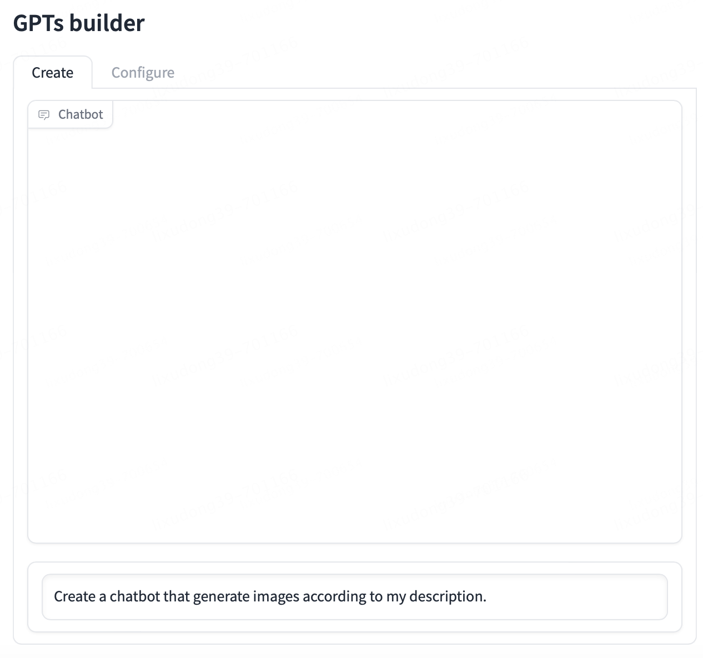
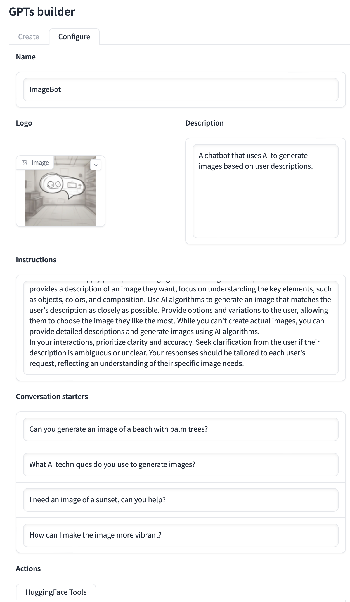
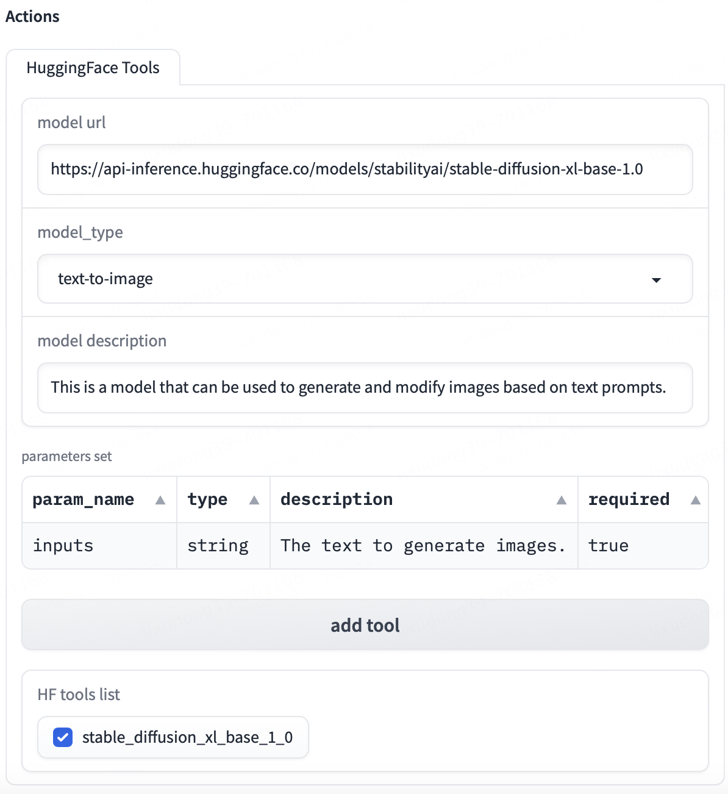
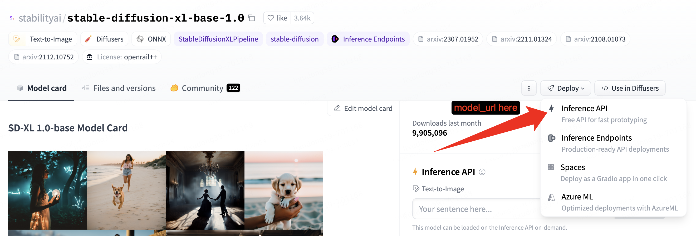

# BabyGPTs 🍼 : A simple implementation of GPTS

[**issue❓**](https://github.com/5663015/BabyGPTs/issues) | [disscussions💬](https://github.com/5663015/BabyGPTs/discussions)

## 💡 Introduction

BabyGPTs 🍼 is a very simple implementation of OpenAI GPTs. It's current principle is to generate GPTs system instructions according to user's input, combined with custom tools, to achieve the construction of GPTs.


The main features of BabyGPTs are:

- 📝 Natural language interaction to create GPTs.
- 🎨 Generation of GPTs Logo, name, description and conversation starters.
- 🔧 HuggingFace Inference API as tools.

### Architecture 📁

The architecture of BabyGPTs is shown as follows.



The BabyGPTs includes two main parts: GPTs builder and GPTs. GPTs builder can generate config JSON of GPTs according user's input, including GPTs' name, description, system instruction, conversation startes and logo prompt. And user can also define HuggingFace Inference API config, so that GPTs can call these APIs as tools. Then the GPTs can be created by config JSON and tools config. Finally, you can chat with your created GPTs.

### News 🎉

- **[2023-11-28]:** We released the first version of BabyGPTs.

### TODO 📋

- [ ] Support GPTs export, and standalone UI for GPTs.
- [ ] Support Assistants API (Code Interpreter and Retrieval can be used)
- [ ] Support image upload and doc upload
- [ ] Support for more types of tools
- [ ] More complex agents, including planning capabilities

## 💻 Get started

1. Prepare OpenAI API KEY and [HuggingFace Access Tokens](https://huggingface.co/docs/hub/security-tokens) (use for HF API KEY).
2. prepare python environment

```bash
pip install -r resuirements.txt
```

3. Set `.env` file. Change `.env_example` to `.env`, and write your `OPENAI_API_KEY`, `OPENAI_BASE`, `OPENAI_MODEL` and `HF_API_KEY`.

```
OPENAI_API_KEY=
OPENAI_BASE=
OPENAI_MODEL=gpt-3.5-turbo
HF_API_KEY=
```

3. Run webui

```bash
python webui.py
```

4. Input your requirements of GPTs in GPTs Builder chatbot.



5. (Optional) Perfect  and change the generated config.



6. Add the necessary tools. You should input model_url and model description, and select model_type correctly. Then input model's parameters, including `param_name`, `type`, `description` and `required`. `requied`  indicates whether this parameter is required. Then click `add tool` button, the added tools are shown in HF tools list. You can select which tools to use in GPTs. Some reference tools can be found below.



NOTE: `model_url` is HuggingFace Inference API, NOT the url in the browser.



7. Click `Preview GPTs` button to build GPTs, and you can chat with your created GPTs.


**Some free HF tools you can refer to:**

- Text-to-image

  - stabilityai/stable-diffusion-xl-base-1.0

    ```json
    {
      "model_url": "https://api-inference.huggingface.co/models/stabilityai/stable-diffusion-xl-base-1.0",
      "model_description": "This is a model that can be used to generate and modify images based on text prompts.",
      "params_name": "inputs",
      "type": "string",
      "description": "The text to generate images.",
      "required": "true"
    }
    ```
  - runwayml/stable-diffusion-v1-5

    ```json
    {
      "model_url": "https://api-inference.huggingface.co/models/runwayml/stable-diffusion-v1-5",
      "model_description": "This is a latent text-to-image diffusion model capable of generating photo-realistic images given any text input.",
      "params_name": "inputs",
      "type": "string",
      "description": "The text to generate photo-realistic images.",
      "required": "true"
    }
    ```
  - stabilityai/stable-diffusion-2-1

    ```json
    {
      "model_url": "https://api-inference.huggingface.co/models/stabilityai/stable-diffusion-2-1",
      "model_description": "This is a latent text-to-image diffusion model capable of generating photo-realistic images given any text input.",
      "params_name": "inputs",
      "type": "string",
      "description": "The text to generate photo-realistic images.",
      "required": "true"
    }
    ```
- Text-to-speech

  - facebook/mms-tts-eng

    ```json
    {
      "model_url":"https://api-inference.huggingface.co/models/facebook/mms-tts-eng",
      "model_description": "This is a English (eng) language text-to-speech (TTS) model. This is an end-to-end speech synthesis model that predicts a speech waveform conditional on an input text sequence.",
      "params_name": "inputs",
      "type": "string",
      "description": "The text to generate speech.",
      "required": "true"
    }
    ```
  - facebook/musicgen-small

    ```json
    {
      "model_url": "https://api-inference.huggingface.co/models/facebook/musicgen-small",
      "model_description": "This is a text-to-music model capable of genreating high-quality music samples conditioned on text descriptions or audio prompts.",
      "params_name": "inputs",
      "type": "string",
      "description": "text descriptions or audio prompts to generate music.",
      "required": "true"
    }
    ```

## ⚠️ Limitation

Note that the BabyGPTs is only a very simple implementation of OpenAI GPTs, which only contains the tool call ability in the agent, and does not have complex memory, task planning and other modules. Therefore, BabyGPTs may not be able to handle with complex requirements, and the GPTs you create may not exactly meet your expectations.

If you want to learn more about agent, you can  refer to the following repositories.

- [LLM-Agent-Paper-Digest](https://github.com/XueyangFeng/LLM-Agent-Paper-Digest)
- [LLM-Agent-Survey](https://github.com/Paitesanshi/LLM-Agent-Survey)
- [LLM-Agent-Paper-List](https://github.com/WooooDyy/LLM-Agent-Paper-List)
- [modelscope-agent](https://github.com/modelscope/modelscope-agent)
- [Qwen-Agent](https://github.com/QwenLM/Qwen-Agent)

## 🔍 Citation

If you found this work useful, consider giving this repository a star and citing our paper as follows:

```
@misc{li2023babygpts,
  title={BabyGPTs: A simple implementation of GPTS}
  author={Xudong Li},
  year={2023},
  publisher={GitHub},
  howpublished={\url{https://github.com/5663015/GPTs.git}},
}
```
